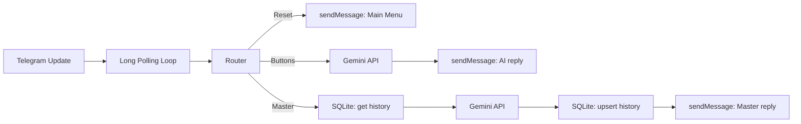

# MediBot | Голос Души

Проект переносит сценарий Make (`Голос Души.blueprint.json`) в самостоятельного Telegram-бота на Python

Бот:
- принимает сообщения через `long polling` (без webhook);
- генерирует ответы через Google Gemini API (модель `gemma-3-12b-it`);
- хранит историю диалога пользователя в SQLite;
- поддерживает единый HTTP/HTTPS-прокси для Telegram API и Gemini API;
- готов к запуску в Docker.

## Что делает бот

Логика повторяет исходный Make-сценарий:

1. `/start` или `🛑 Завершить диалог с мастером`
   - бот возвращает пользователя в главное меню;
   - очищает историю диалога в базе
2. Нажатие кнопок главного меню
   - бот выбирает инструкцию по конкретной кнопке;
   - отправляет запрос в Gemini;
   - возвращает короткий поддерживающий ответ
3. Любой другой текст (включая `🧙‍♂️ Поговорить с Мастером`)
   - бот работает в режиме «Мастер» с учетом истории;
   - сохраняет новый фрагмент истории (`User` / `Master`) в SQLite;
   - отправляет ответ и клавиатуру с кнопкой завершения диалога

Аудио-ветки предусмотрены в конфигурации, но по умолчанию выключены (`AUDIO_ENABLED=false`)

## Архитектура



## Структура проекта

```text
app/
  config.py        # загрузка и валидация .env
  main.py          # polling loop и обработка update
  router.py        # ветвление логики (reset/buttons/master)
  telegram_api.py  # Telegram Bot API клиент
  gemini_api.py    # Gemini generateContent клиент
  storage.py       # SQLite-хранилище истории
Dockerfile
docker-compose.yml
.env.example
```

## Переменные окружения

Создайте `.env` на основе `.env.example`.

| Переменная | Обязательна | По умолчанию | Назначение |
|---|---|---|---|
| `TELEGRAM_BOT_TOKEN` | Да | - | Токен Telegram-бота |
| `GEMINI_API_KEY` | Да | - | Ключ Google Gemini API |
| `GEMINI_MODEL` | Нет | `gemma-3-12b-it` | Модель Gemini |
| `HTTP_PROXY` | Нет | - | HTTP-прокси для всех исходящих запросов |
| `HTTPS_PROXY` | Нет | - | HTTPS-прокси (должен совпадать с `HTTP_PROXY`) |
| `SQLITE_PATH` | Нет | `/data/medibot.db` | Путь к SQLite-файлу |
| `POLL_TIMEOUT_SEC` | Нет | `30` | Таймаут long polling |
| `POLL_RETRY_DELAY_SEC` | Нет | `2` | Пауза перед повтором при ошибке |
| `AUDIO_ENABLED` | Нет | `false` | Включение отправки аудио |
| `AUDIO_ID_HEAVY` и др. | Нет | пусто | `file_id` для 6 кнопок (если аудио включено) |

## Быстрый запуск в Docker

1. Клонирование репозитория:
   ```bash
   git clone https://github.com/shishkin-github/medibot.git
   cd medibot
   ```
```

2. Заполните в `.env` минимум:
- `TELEGRAM_BOT_TOKEN`
- `GEMINI_API_KEY`
- `HTTP_PROXY` и `HTTPS_PROXY` (если работаете через прокси)

3. Запустите:

```bash
docker compose up --build -d
```

4. Логи:

```bash
docker compose logs -f
```

5. Остановка:

```bash
docker compose down
```

## Локальный запуск (без Docker)

```bash
python -m venv .venv
source .venv/bin/activate
pip install -r requirements.txt
python -m app.main
```

## Как бот хранит историю

Таблица `dialog_memory`:
- `chat_id` (`PRIMARY KEY`)
- `history` (`TEXT`)
- `updated_at` (`TEXT`, ISO UTC)

