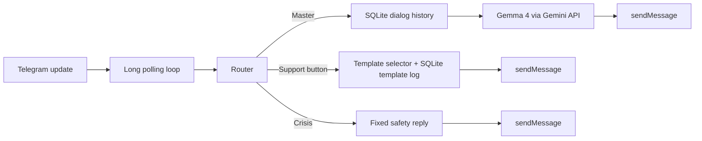

[English](README.md) | [Русский](README.ru.md)

# MediBot

MediBot is an open-source Telegram bot for gentle emotional support in Russian. It combines curated support templates for common difficult states with a separate "Master" mode powered by Gemma 4 through the Google Gemini API

The repository is aimed at makers who want a transparent and easy-to-run support bot: predictable button replies, lightweight infrastructure, SQLite persistence, and a dedicated safety route for crisis messages

## What the bot does

- gives deterministic support replies for six quick-help buttons
- rotates support templates to reduce repetition for the same user
- switches to a conversational "Master" mode for free-form messages
- stores Master-mode dialog history in SQLite
- routes crisis-language messages away from normal flows into a fixed safety response
- works through `long polling`, with optional proxy support and Docker deployment

## Conversation modes

### Support buttons

The main menu includes six support buttons:

- `💭 Мне тяжело`
- `🌫 Я потерял себя`
- `💔 Я ничего не хочу`
- `🌿 Хочу почувствовать покой`
- `💫 Хочу вспомнить смысл`
- `📿 Получить практику`

These buttons do not call an LLM. They use a curated template catalog based on [`mediabot_support_templates.md`](mediabot_support_templates.md) with anti-repeat rules:

- the last 7 templates in the same block are excluded
- the same method family is not repeated twice in a row
- the exact template has a 14-day cooldown

### Master mode

Any free-form message that is not a reset command, crisis message, or support button goes to Master mode

Master mode:

- uses `gemma-4-26b-a4b-it`
- calls Gemini API in a fast, non-thinking profile
- returns short, warm replies
- stores `User / Master` history in SQLite for context

### Crisis route

If a message contains crisis markers such as self-harm or suicide intent, the bot does not continue the normal conversation. It returns a fixed safety response and does not add that message to ordinary Master history

## Quick start with Docker

1. Clone the repository

```bash
git clone https://github.com/shishkin-github/medibot.git
cd medibot
```

2. Create `.env` from `.env.example`

```bash
cp .env.example .env
```

3. Fill in at least:

- `TELEGRAM_BOT_TOKEN`
- `GEMINI_API_KEY`
- `HTTP_PROXY` and `HTTPS_PROXY` if you need a proxy

4. Start the bot

```bash
docker compose up --build -d
```

5. View logs

```bash
docker compose logs -f
```

6. Stop the bot

```bash
docker compose down
```

## Local run

```bash
python -m venv .venv
source .venv/bin/activate
pip install -r requirements.txt
python -m app.main
```

## Environment variables

| Variable | Required | Default | Purpose |
|---|---|---|---|
| `TELEGRAM_BOT_TOKEN` | yes | - | Telegram bot token |
| `GEMINI_API_KEY` | yes | - | Google Gemini API key |
| `GEMINI_MODEL` | no | `gemma-4-26b-a4b-it` | Gemma model for Master mode |
| `CRISIS_SUPPORT_MESSAGE` | no | built-in Russian safety text | Safety reply for crisis route |
| `HTTP_PROXY` | no | - | Proxy URL for outbound traffic |
| `HTTPS_PROXY` | no | - | Must match `HTTP_PROXY` in this project |
| `SQLITE_PATH` | no | `/data/medibot.db` | SQLite database path |
| `POLL_TIMEOUT_SEC` | no | `30` | Telegram polling timeout |
| `POLL_RETRY_DELAY_SEC` | no | `2` | Delay before retry after polling error |
| `AUDIO_ENABLED` | no | `false` | Enables optional audio sends for support buttons |
| `AUDIO_ID_HEAVY` and related vars | no | empty | Telegram `file_id` values for button audio |

## Architecture



## Project structure

```text
app/
  config.py
  gemini_api.py
  main.py
  router.py
  storage.py
  support_templates.py
  telegram_api.py
  text_utils.py
tests/
  ...
.env.example
Dockerfile
docker-compose.yml
requirements.txt
```

## Running tests

```bash
pytest -q
```

The current suite covers:

- Gemma request payloads and retries
- UI text normalization
- support-template anti-repeat logic
- storage behavior
- router behavior
- smoke flows for support, Master fallback, and crisis routing

## Safety and limitations

MediBot is a support bot, not a medical device, crisis hotline, or diagnostic tool

Current limitations:

- there is no country-specific emergency contact database
- Master history is stored in full and is not yet compacted
- there is no built-in analytics dashboard for template performance or crisis-hit rate
- the bot focuses on Russian-language messaging and is not localized yet

## Project note

This repository grew out of an earlier Make-based automation flow. The current version is a standalone Python implementation intended to be easier to run, test, and evolve in a public repository
