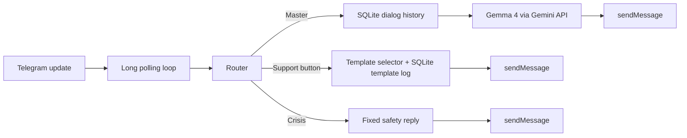

[English](README.md) | [Русский](README.ru.md)

# MediBot

MediBot — open-source Telegram-бот для бережной эмоциональной поддержки на русском языке. Он сочетает подготовленные шаблоны поддержки для типовых состояний с отдельным режимом «Мастер», который работает на Gemma 4 через Google Gemini API

Репозиторий рассчитан на тех, кто хочет получить прозрачного и простого в запуске support-бота: предсказуемые ответы на кнопки, лёгкую инфраструктуру, хранение данных в SQLite и отдельный safety-маршрут для кризисных сообщений

## Что умеет бот

- даёт детерминированные ответы для шести support-кнопок
- ротирует шаблоны, чтобы одному пользователю реже попадались повторы
- переключается в разговорный режим «Мастер» для свободных сообщений
- хранит историю диалога режима «Мастер» в SQLite
- уводит кризисные сообщения из обычного потока в фиксированный безопасный ответ
- работает через `long polling`, поддерживает прокси и запуск в Docker

## Режимы общения

### Support-кнопки

В главном меню доступны шесть кнопок:

- `💭 Мне тяжело`
- `🌫 Я потерял себя`
- `💔 Я ничего не хочу`
- `🌿 Хочу почувствовать покой`
- `💫 Хочу вспомнить смысл`
- `📿 Получить практику`

Эти кнопки не вызывают LLM. Они используют каталог шаблонов на основе [`mediabot_support_templates.md`](mediabot_support_templates.md) и правила анти-повтора:

- исключаются последние 7 шаблонов в рамках одного блока
- одна и та же `method_family` не выдаётся подряд
- у точного шаблона есть cooldown на 14 дней

### Режим «Мастер»

Любое свободное сообщение, которое не является reset-командой, кризисным сообщением или support-кнопкой, уходит в режим «Мастер»

Режим «Мастер»:

- использует `gemma-4-26b-a4b-it`
- ходит в Gemini API в быстром профиле без thinking
- отвечает коротко и мягко
- хранит историю `User / Master` в SQLite для контекста

### Crisis route

Если в сообщении есть кризисные маркеры вроде самоповреждения или суицидального намерения, бот не продолжает обычный диалог. Он отправляет фиксированный safety-ответ и не сохраняет это сообщение в обычную историю режима «Мастер»

## Быстрый запуск в Docker

1. Клонируйте репозиторий

```bash
git clone https://github.com/shishkin-github/medibot.git
cd medibot
```

2. Создайте `.env` на основе `.env.example`

```bash
cp .env.example .env
```

3. Заполните как минимум:

- `TELEGRAM_BOT_TOKEN`
- `GEMINI_API_KEY`
- `HTTP_PROXY` и `HTTPS_PROXY`, если нужен прокси

4. Запустите бота

```bash
docker compose up --build -d
```

5. Посмотрите логи

```bash
docker compose logs -f
```

6. Остановите контейнеры

```bash
docker compose down
```

## Локальный запуск

```bash
python -m venv .venv
source .venv/bin/activate
pip install -r requirements.txt
python -m app.main
```

## Переменные окружения

| Переменная | Обязательна | По умолчанию | Назначение |
|---|---|---|---|
| `TELEGRAM_BOT_TOKEN` | да | - | Токен Telegram-бота |
| `GEMINI_API_KEY` | да | - | API-ключ Google Gemini |
| `GEMINI_MODEL` | нет | `gemma-4-26b-a4b-it` | Модель Gemma для режима «Мастер» |
| `CRISIS_SUPPORT_MESSAGE` | нет | встроенный safety-текст на русском | Ответ для crisis route |
| `HTTP_PROXY` | нет | - | Прокси для исходящих запросов |
| `HTTPS_PROXY` | нет | - | В этом проекте должен совпадать с `HTTP_PROXY` |
| `SQLITE_PATH` | нет | `/data/medibot.db` | Путь к SQLite-базе |
| `POLL_TIMEOUT_SEC` | нет | `30` | Таймаут Telegram polling |
| `POLL_RETRY_DELAY_SEC` | нет | `2` | Пауза перед повтором после ошибки polling |
| `AUDIO_ENABLED` | нет | `false` | Включает отправку аудио для support-кнопок |
| `AUDIO_ID_HEAVY` и связанные переменные | нет | пусто | Telegram `file_id` для аудио по кнопкам |

## Архитектура



## Структура проекта

```text
app/
  config.py
  gemini_api.py
  main.py
  router.py
  storage.py
  support_templates.py
  telegram_api.py
  text_utils.py
tests/
  ...
.env.example
Dockerfile
docker-compose.yml
requirements.txt
```

## Запуск тестов

```bash
pytest -q
```

Текущее покрытие включает:

- payload и retry-логику запросов к Gemma
- нормализацию UI-текстов
- анти-повтор support-шаблонов
- поведение storage
- логику router
- smoke-сценарии для support, fallback режима «Мастер» и crisis-routing

## Safety и ограничения

MediBot — это support-бот, а не медицинское изделие, кризисная линия или диагностический инструмент

Текущие ограничения:

- нет базы экстренных контактов по странам
- история режима «Мастер» хранится целиком и пока не сжимается
- нет встроенной аналитики по эффективности шаблонов и частоте crisis-hit
- бот ориентирован на русскоязычные сообщения и пока не локализован

## Примечание о проекте

Репозиторий вырос из более раннего сценария в Make. Текущая версия — это самостоятельная Python-реализация, которую проще запускать, тестировать и развивать как публичный проект
